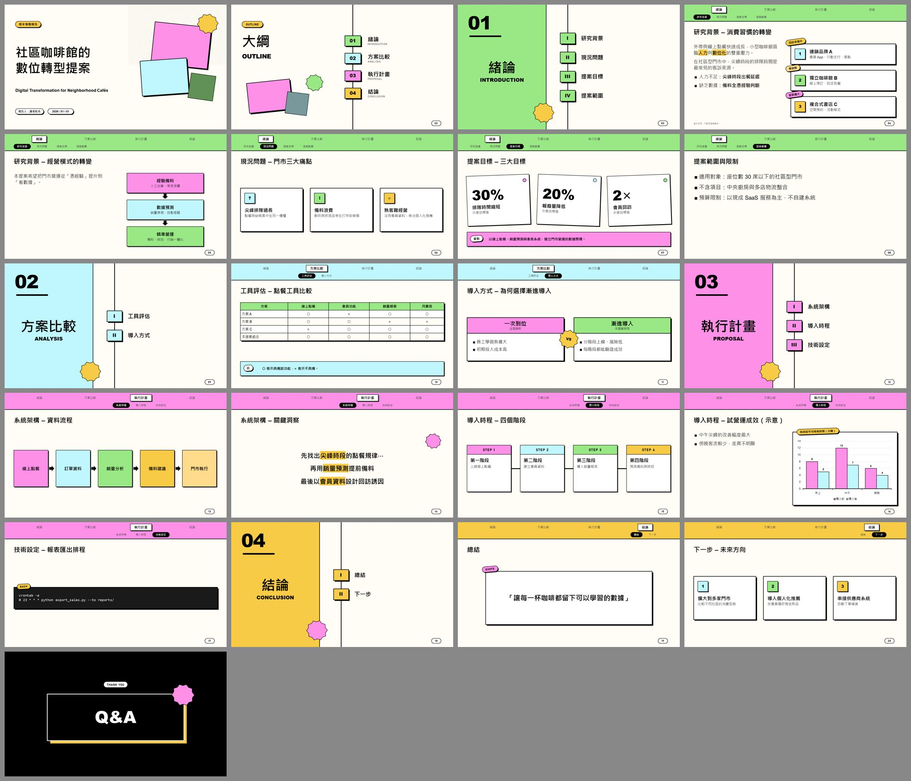

# hyperframes_pptx

**Markdown 文稿 + 素材 → 可編輯的 PowerPoint（.pptx）**

一個 [Claude Code](https://claude.com/claude-code) skill：你寫好 Markdown 稿子、準備好圖片，Claude 就會依標題階層產生封面、大綱、章節子目錄、帶導覽列的內容頁，並把適合的段落轉成資訊圖表，最後輸出一份可以直接在 PowerPoint 裡繼續編輯的簡報。

預設主題移植自 [HyperFrames](https://github.com/heygen-com/hyperframes) 的 **BlockFrame 糖果色塊**：黑色粗邊框、零模糊硬陰影、五色色塊逐章輪替。工作流架構參考自 [boring-video-studio](https://github.com/sugarforever/boring-video-studio)。


<details>
<summary>完整範例（21 頁）</summary>



</details>

---

## 目錄

- [功能](#功能)
- [安裝](#安裝)
- [快速開始](#快速開始)
- [撰寫稿子](#撰寫稿子)
- [資訊圖表元件](#資訊圖表元件)
- [主題與模版](#主題與模版)
- [指令參考](#指令參考)
- [常見問題](#常見問題)
- [專案結構](#專案結構)

---

## 功能

| 頁面 | 說明 |
|---|---|
| **封面** | 標題、副標、報告人、日期，搭配傾斜色塊與星爆裝飾 |
| **大綱** | 所有章節串在一條直線上，編號色塊＋中英文章名 |
| **章節頁** | 左側章節色面板（大編號＋章名＋英文名），右側列出該章子章節（I、II、III…） |
| **內容頁** | 頂部導覽列：第一排是所有章節，目前章節凸顯；第二排是本章子章節，目前位置反白 |
| **資訊圖表** | 卡片、流程、步驟、時間軸、大數字、左右對比、原生圖表、表格、提示框、宣言頁 |
| **結尾頁** | 黑底反白 Q&A |

其他：
- 自動拆頁：文字放不下時對半拆，後頁加「（續）」
- 中文斷行處理
- 講者備註
- 頁尾資料來源
- 頁碼

---

## 安裝

### 1. 需求

- Python 3.10 以上
- [Claude Code](https://claude.com/claude-code)（用 skill 方式操作時需要；只用腳本則不需要）
- 預覽功能需要 **PowerPoint（Windows）** 或 **LibreOffice**

### 2. 下載並安裝依賴

```bash
git clone https://github.com/ChienIKao/hyperframes_pptx.git
cd hyperframes_pptx
pip install -r requirements.txt
```

### 3. 註冊成 Claude Code 的 skill

把 `skills/md-to-pptx` 連結到 `~/.claude/skills/`，Claude Code 在任何專案都能用：

**Windows（cmd，不需系統管理員）**

```bat
mklink /J "%USERPROFILE%\.claude\skills\md-to-pptx" "C:\path\to\hyperframes_pptx\skills\md-to-pptx"
```

**macOS / Linux**

```bash
ln -s "$(pwd)/skills/md-to-pptx" ~/.claude/skills/md-to-pptx
```

重新開啟 Claude Code 後，skill 清單中會出現 `md-to-pptx`。

---

## 快速開始

### 方式一：交給 Claude（推薦）

在 Claude Code 裡直接說：

> 用 md-to-pptx 把 `talk.md` 做成簡報，素材在 `images/`

Claude 會：
1. 問你要用哪個主題，以及要「照稿直出」還是「幫我精煉」
2. 建立專案目錄，把稿子整理成工作稿 `deck.md`：修正階層、補英文章名、把適合的內容轉成資訊圖表、放入素材
3. 建置 `.pptx`
4. 自動檢查文字溢出，並渲染每一頁逐張目視檢查
5. 修正問題後重建，最後回報做了哪些調整

原稿不會被修改，所有調整都在 `deck.md`。

### 方式二：直接跑腳本

```bash
cd skills/md-to-pptx/examples
python ../scripts/build_deck.py build demo.md -o output/demo.pptx   # 建置
python ../scripts/build_deck.py dump output/demo.pptx               # 檢查內容與溢出
python ../scripts/preview.py output/demo.pptx                       # 渲染預覽圖
```

---

## 撰寫稿子

### 標題階層

```markdown
---
eyebrow: 期末專題報告
subtitle: Digital Transformation for Neighborhood Cafés
author: 報告人：講者姓名
date: 2026 / 01 / 01
---

# 簡報題目                          ← 封面

## 緒論 | Introduction              ← 章：大綱項目 + 章節頁（| 後面是英文副標）

### 研究背景                         ← 子章節：章節頁子目錄 + 導覽列第二排

#### 消費習慣的轉變                  ← 一張投影片
```

- 投影片標題會自動組成「**研究背景 – 消費習慣的轉變**」。
- `###` 底下直接寫內容（不寫 `####`）也可以，會以子章節名當標題產生一張投影片。
- 在投影片內用 `---` 可以強制換頁。

### 行內與段落語法

| 寫法 | 效果 |
|---|---|
| `- 項目`／`1. 項目` | 條列／編號（縮排為子層） |
| `**粗體**` | 粗體 |
| `==關鍵詞==` | 螢光筆色塊強調 |
| `` | 加框圖片＋圖說標籤 |
| Markdown 表格 | 原生表格，○ × 自動置中 |
| `> [!NOTE] 文字` | 頁底提示框。另有 `TIP`、`IMPORTANT`、`WARNING`、`SUMMARY` |
| `資料來源：…` | 頁尾小字出處 |
| `> 一句話`（整頁只有它） | 引言卡片頁 |
| 只有幾段文字＋`==強調==` | 置中大字的宣言頁 |
| `<!-- 講者備註 -->` | 講者備註，不會顯示在投影片上 |

### Front matter 常用設定

| 欄位 | 說明 | 預設 |
|---|---|---|
| `theme` | 主題 | `blockframe` |
| `eyebrow` | 封面左上標籤 | `PRESENTATION` |
| `subtitle`、`author`、`date` | 封面資訊 | — |
| `logo_left`、`logo_right` | 導覽列兩側 logo 圖片 | — |
| `recap` | 每個子章節開始前重放章節頁並標出目前位置 | `false` |
| `title_format` | 內容頁標題格式 | `{sub} – {title}` |
| `closing` | 結尾頁文字（`false` 不產生） | `Q&A` |

完整規格：[`references/markdown-spec.md`](skills/md-to-pptx/references/markdown-spec.md)

---

## 資訊圖表元件

用程式碼區塊標記，裡面每個項目以 ` | ` 分欄：

````markdown
```cards stack
- 連鎖品牌 A | 會員 App、行動支付、集點 | tag: 回訪率提升 | img: assets/logo-a.png
- 獨立咖啡館 B | 線上預訂、到店取餐 | tag: 零排隊
```
````

| 元件 | 適合的內容 | 範例 |
|---|---|---|
| `cards` | 並列的案例、問題、亮點 | `- 標題 \| 說明 \| tag: 標籤 \| icon: ? \| img: 路徑` |
| `flow` | 狀態演進、系統流程 | `- 經驗備料 \| 人工估算`，或單行 `A -> B -> C` |
| `steps` | 方法步驟（直向） | `- 資料蒐集 \| 問卷與訪談` |
| `timeline` | 階段步驟（橫向） | 同 `steps` |
| `stats` | 關鍵數字 | `- 30% \| 排隊時間縮短 \| 補充說明` |
| `compare` | 兩三個方案對比 | `- 漸進導入 \| 本提案` 加上縮排的子項目 |
| `chart` | 實驗數據 | ```` ```chart column 標題 ```` 內放 Markdown 表格 |

- `chart` 支援 `column`、`bar`、`line`、`pie`、`doughnut`、`stacked`。
- `cards` 可加 `stack`（直向堆疊）、`grid`、`cols=3`。
- `flow`／`steps` 可加 `vertical`、`horizontal`。

內容型態對照與版面規則：[`references/infographics.md`](skills/md-to-pptx/references/infographics.md)
完整示範：[`examples/demo.md`](skills/md-to-pptx/examples/demo.md)（內容與數字皆為虛構）

---

## 主題與模版

| 類型 | 使用方式 | 特色 |
|---|---|---|
| **主題** `blockframe`（預設） | `theme: blockframe` | 完整功能：大綱、章節子目錄、導覽列、資訊圖表 |
| 主題 `default` | `theme: default` | 基本深藍風格，不含導覽列 |
| **.pptx / .potx 模版** | `--template 路徑` 或放進 `templates/<名稱>/` | 使用你的母片；資訊圖表會退化成條列與表格 |

- **註冊自己的模版**：`build_deck.py inspect 模版.pptx --write-config config.json` 會列出版面並自動對應角色（封面、內容、章節頁…）。
- **移植其他 HyperFrames 設計**：複製 `themes/blockframe.json`，依 `FRAME.md` 改配色、邊框、陰影與字型。

詳細步驟：[`references/templates-and-themes.md`](skills/md-to-pptx/references/templates-and-themes.md)

---

## 指令參考

```bash
# 建置
python scripts/build_deck.py build deck.md -o out.pptx [--theme 名稱|路徑] [--template 名稱|路徑] [--assets 素材目錄]

# 列出內容並檢查溢出、超出邊界
python scripts/build_deck.py dump out.pptx

# 分析模版版面，產生設定檔
python scripts/build_deck.py inspect template.pptx [--write-config config.json]

# 渲染每頁 PNG + 總覽 grid.png
python scripts/preview.py out.pptx [--out 目錄] [--cols 4]
```

---

## 常見問題

**字型跟 HyperFrames 網站上不一樣？**
BlockFrame 原本用 Inter／Space Grotesk，Windows 沒有內建，所以換成 Arial Black（標題）、Bahnschrift（標籤）、微軟正黑體（中文）。這樣換到其他電腦也不會跑版。要改可以編輯 `themes/blockframe.json` 的 `fonts`。

**`==強調==` 沒有色塊？**
螢光筆效果需要 PowerPoint 2019／Microsoft 365 以上版本。

**文字被縮得很小？**
左欄文字建議 5 條以內。細節可以移到 `<!-- 講者備註 -->`，或用 `---` 手動拆頁。

**可以接著在 PowerPoint 裡改嗎？**
可以，所有元素都是原生的圖形、文字框、表格與圖表。但重新建置會覆蓋手動修改，建議改稿子後重建。

**支援 SVG 圖片嗎？**
不支援，請先轉成 PNG。

更多問題：[`references/qa.md`](skills/md-to-pptx/references/qa.md)

---

## 專案結構

```
skills/md-to-pptx/
├── SKILL.md                     Claude 的流水線編排指引
├── references/
│   ├── markdown-spec.md         Markdown 撰寫規格
│   ├── infographics.md          內容 → 資訊圖表元件對照
│   ├── templates-and-themes.md  主題／模版清單與移植方法
│   └── qa.md                    驗收流程與常見問題
├── scripts/
│   ├── build_deck.py            CLI、Markdown 解析、模版引擎
│   ├── canvas_deck.py           canvas 引擎（依主題 token 繪製）
│   └── preview.py               渲染預覽
├── themes/                      blockframe.json、default.json
├── templates/                   放你的 .pptx 模版
└── examples/                    demo.md（全元件示範）、sample.md
```

---

## 授權

[MIT](LICENSE)
